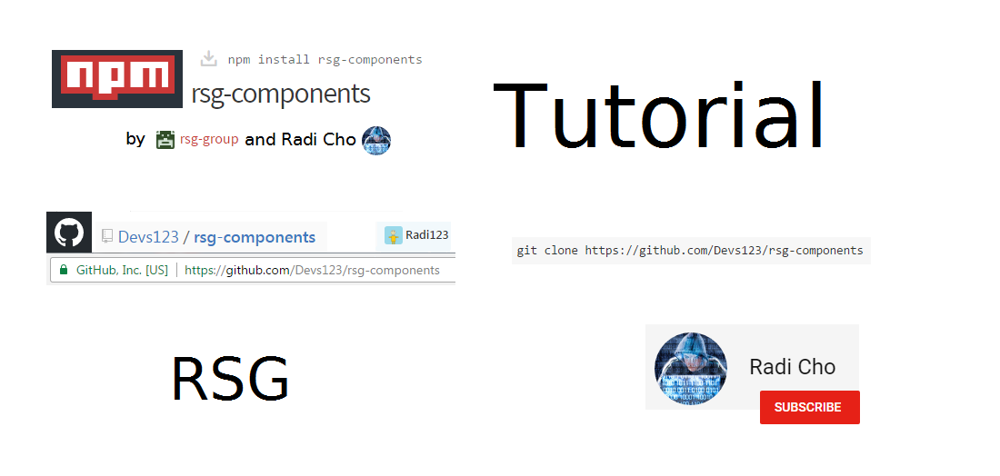

# Hello in rsg-components #

* Install <br>
```
npm install rsg-components
```
or <br>
```
npm install rsg-components@version
```
or <br>
```
git clone https://github.com/Devs123/rsg-components
``` 

# YouTube tutorial: #
[Click here or on the image for youtube tutorial](https://www.youtube.com/playlist?list=PLBKNj-_iswgrl1XNhpfgGKwfrP_hEoZ2x): </br> [](https://www.youtube.com/playlist?list=PLBKNj-_iswgrl1XNhpfgGKwfrP_hEoZ2x) </br>
### Plase subscribe: </br> [](https://www.youtube.com/c/RadiCho)

### How to use: ###
```
<RSGComponentsName props>children</RSGComponentsName>
```

View all components, props and styles on GitHub wiki page: [https://github.com/Devs123/rsg-components/wiki/](https://github.com/Devs123/rsg-components/wiki/)

### Versions: ###
* 1.1.3 <br>
Versions 1.1.3 or previous are tests and have bugs

### WARNING: versions previous 2.0.0 have bugs ###

* 2.0.0 <br>
In 2.0.0 you can use the cmponent: ``` RSGButton ``` <br>
[https://github.com/Devs123/rsg-components/wiki/RSGButton](https://github.com/Devs123/rsg-components/wiki/RSGButton)

* 2.0.1 <br>
README.md added

* 2.0.2 <br>
In 2.0.2 you can use the cmponent: ``` RSGBox ``` <br>
[https://github.com/Devs123/rsg-components/wiki/RSGBox](https://github.com/Devs123/rsg-components/wiki/RSGBox)

* 2.0.3 <br>
In 2.0.3 you can use the cmponent: ``` RSGLabel ``` <br>
[https://github.com/Devs123/rsg-components/wiki/RSGLabel](https://github.com/Devs123/rsg-components/wiki/RSGLabel) <br/>
``` RSGBox ``` bug fixed

* 2.0.4 <br>
``` RSGLabel ``` bug fixed

* 2.0.5 <br>
Added github repository in package.json

* 2.0.6 <br>
In 2.0.6 you can use the cmponent: ``` RSGFormBasic ``` <br>
[https://github.com/Devs123/rsg-components/wiki/RSGFormBasic](https://github.com/Devs123/rsg-components/wiki/RSGFormBasic)

* 2.0.7 <br>
In 2.0.7 you can use the ``` RSGTransition ``` style function <br>
[https://github.com/Devs123/rsg-components/wiki/RSGTransition](https://github.com/Devs123/rsg-components/wiki/RSGTransition) <br>
Note: Added sample paragraph in index.html

* 2.0.8 <br>
In 2.0.8 you can use the component ``` RSGProgressBar ``` <br>
[https://github.com/Devs123/rsg-components/wiki/RSGProgressBar](https://github.com/Devs123/rsg-components/wiki/RSGProgressBar) <br>
Note: Added new images in GitHub repo.

* 2.0.9 <br>
In 2.0.9 you can read tips at ``` ..../rsg-components/tips ``` <br>

* 2.0.10 <br>
You can read tips at ``` ..../rsg-components/tips ``` <br>
``` RSGProgressBar ``` bug fixed <br>
``` README.md ``` edited <br>
NOTE: Added new images for wiki

* 2.0.11 <br>
Update: ``` RSGProgressBar ```

* 2.0.12 <br>
YouTube tutorial - [https://www.youtube.com/playlist?list=PLBKNj-_iswgrl1XNhpfgGKwfrP_hEoZ2x](https://www.youtube.com/playlist?list=PLBKNj-_iswgrl1XNhpfgGKwfrP_hEoZ2x) </br>
Please subscribe for my channel: (http://youtube.com/c/RadiCho)[http://youtube.com/c/RadiCho]